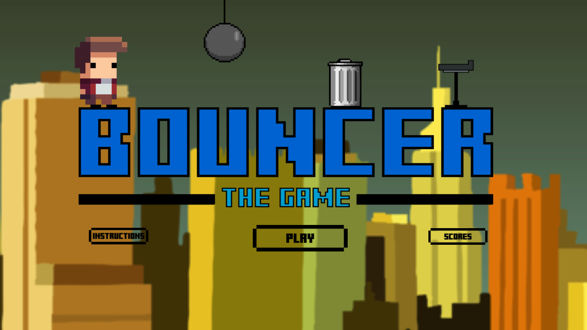
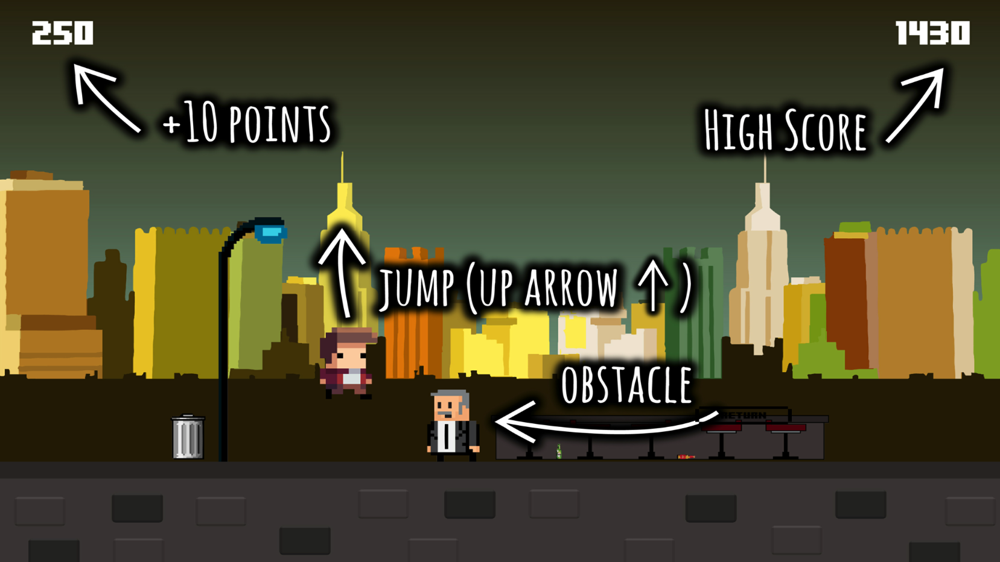
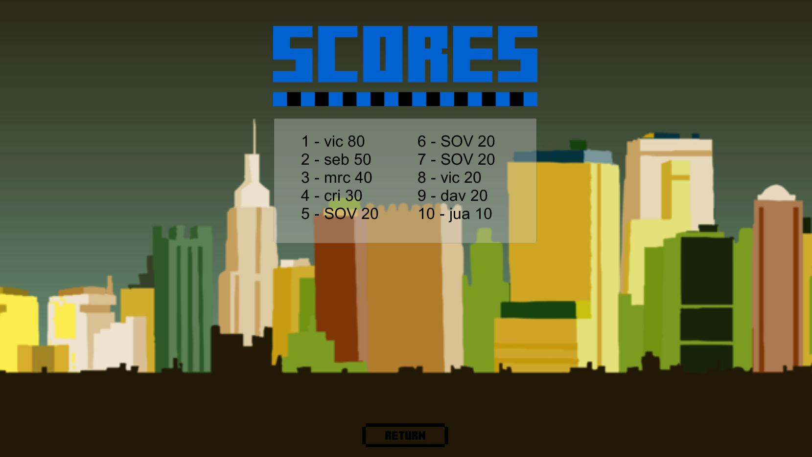
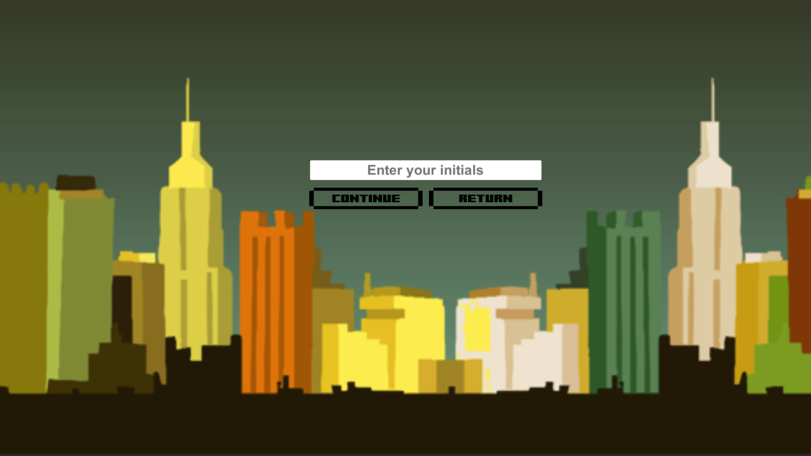
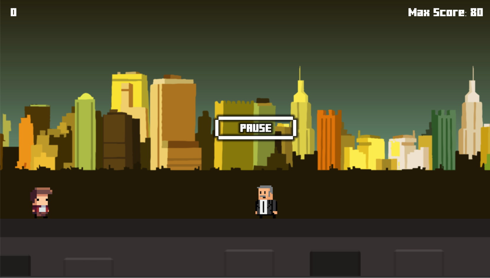

# Bouncer

**Developed with Unity**

Bouncer is a 2D game with 8-bit theme, it is a simple runner where you must jump the obstacles while you cross the city

## Features

- Rating system
- Music integrated in the game
- Play & Pause buttons

## Screenshots

- Menu

- Instructions

- Scores

- Initials

- Pause

### Credits

- **Sebastian Ortiz Velez** - *Developer* http://sebastianortiz.tk
- **Victor Khalaf Valls** - *Artist* http://victorkhalaf.com
